# Project Repository

This repository contains the main project code and an advanced DevOps automation system with a modular PR validation framework.

## 🎯 Project Components

### Main Project Files
- `pandora_tc_ext_fm.py` - Main project script
- `golden/` - Golden data for the project (preserved)
- `working/` - Working directory for project data (preserved)
- `crt.pre.install` - Critical pre-installation script for the project
- `make_venv.csh` - Script for setting up the virtual environment

### DevOps CI/CD System

This repository features a state-of-the-art DevOps automation system with 3 core components:

#### 🤖 1. GitHub Actions CI/CD
**Automated validation and deployment pipeline**
- **PR Validation**: Automated testing, security scans, and quality gates
- **Branch Protection**: Automated lint checks on every push
- **Auto-Merge**: Intelligent merge decisions based on quality scores
- **Security**: Vulnerability scanning and compliance checks

#### 🔍 2. Local Consistency Checks
**Pre-commit validation tools for developers**
- **Code Quality**: Python linting, style checks, and complexity analysis
- **Security**: Local security scanning and secret detection
- **Consistency**: Naming conventions, imports, and project standards
- **Waivers**: Managed exceptions for special cases

#### 🛠️ 3. Developer Helper Scripts
**Productivity tools for common workflows**
- **Git Helper**: Streamlined branch creation, commits, and PR management
- **Setup Tool**: Automated environment configuration
- **Config Manager**: Test configuration and validation management

---

## 🚀 Quick Start

### Setting Up the DevOps System

```bash
# 1. Setup environment and configure all components
python devops/release_automation/setup.py

# 2. Run local checks before any Git operations
python devops/consistency_checker/checker.py

# 3. Create feature branch and make changes
python devops/release_automation/git_helper.py create-branch --type feature --issue 123
# ... make your changes ...

# 4. Commit and push (triggers CI/CD automatically)
python devops/release_automation/git_helper.py commit-push --message "Add feature"
```

### Using the Main Project

The main project files remain at the repository root and work independently of the DevOps system.

---

## 📊 PR Validation System

The repository uses an advanced modular PR validation system with intelligent scoring:

### Scoring Thresholds
- **≥85%**: Auto-merge approved ✅
- **65-84%**: Manual review required ⚠️  
- **≤64%**: Merge blocked ❌

### Validation Categories

#### Hard Checks (Must Pass)
- Critical security vulnerabilities
- Python syntax validation
- Dependency security vulnerabilities

#### Soft Checks (Scoring Components)
1. **Code Quality (25%)**: Linting, complexity analysis, code coverage
2. **Security Scan (20%)**: Medium/low security issues detection
3. **Testing (25%)**: Unit tests, integration tests, smoke tests
4. **Documentation (15%)**: Docstring coverage, documentation updates
5. **Compliance (15%)**: License headers, file structure validation

### System Architecture

```mermaid
flowchart TD
    Dev[👨‍💻 Developer] --> Local{🔍 Local Checks}
    Local --> |Pass| Git[📝 Git Operations]
    Local --> |Fail| Fix[🔧 Fix Issues]
    Fix --> Local
    
    Git --> Push[⬆️ Push to Branch]
    Push --> BranchCI[🤖 Branch Lint CI]
    BranchCI --> |Issues Found| Issue[📋 Auto-Create Issues]
    BranchCI --> |Clean| PR[🔄 Create PR]
    
    PR --> PRCI[🚀 PR Validation CI]
    PRCI --> Hard{🛡️ Hard Checks}
    Hard --> |Fail| Block[❌ Block Merge]
    Hard --> |Pass| Soft[📊 Soft Checks]
    
    Soft --> Score{📈 Calculate Score}
    Score --> |≥85%| AutoMerge[✅ Auto-Merge]
    Score --> |65-84%| Review[👀 Manual Review]
    Score --> |<65%| Block
```



---

## 🔧 Developer Tools & Commands

### Consistency Checker
The consistency checker validates code quality and project standards:

```bash
# Run all consistency checks before committing
python devops/consistency_checker/checker.py

# Run specific rule type
python devops/consistency_checker/checker.py --rule python_imports
python devops/consistency_checker/checker.py --rule naming_conventions

# List all available rules
python devops/consistency_checker/checker.py --list-rules

# Run with verbose output for debugging
python devops/consistency_checker/checker.py --verbose

# Skip specific rules
python devops/consistency_checker/checker.py --skip python_imports
```

#### Available Rules
- **python_imports**: Validates Python import statements and organization
- **naming_conventions**: Enforces consistent naming patterns across the project

#### Configuration
- **Main Config**: `devops/consistency_checker/checker_config.yml`
- **Waivers**: `devops/consistency_checker/waivers.yml` - Managed exceptions

### Git Helper
Streamlined Git workflow automation:

```bash
# Create feature branch with proper naming
python devops/release_automation/git_helper.py create-branch --type feature --issue 123 --description "add-new-feature"

# Create other branch types
python devops/release_automation/git_helper.py create-branch --type bugfix --issue 456
python devops/release_automation/git_helper.py create-branch --type hotfix --issue 789

# Commit and push changes
python devops/release_automation/git_helper.py commit-push --message "Implement feature XYZ"

# Create pull request
python devops/release_automation/git_helper.py create-pr --title "Add new feature" --description "Detailed description"

# Check configuration
python devops/release_automation/git_helper.py --check-config

# Reset configuration to defaults
python devops/release_automation/git_helper.py --reset-config
```

### Setup and Configuration Tools

```bash
# Interactive setup for all components
python devops/release_automation/setup.py

# Validate test configurations
python devops/release_automation/test_config_manager.py --validate

# Check environment setup
python devops/release_automation/test_config_manager.py --check-env
```

---

## 📁 Repository Structure

```
├── README.md                     # This file - Complete project and DevOps guide
├── pandora_tc_ext_fm.py          # Main project script
├── golden/                       # Golden data for the project (preserved)
├── working/                      # Working directory for project data (preserved)
├── crt.pre.install              # Critical pre-installation script
├── make_venv.csh                 # Virtual environment setup script
├── requirements.txt              # Python dependencies
│
├── .github/                      # GitHub Actions workflows
│   ├── workflows/                # CI/CD pipeline definitions
│   │   ├── branch-lint-check.yml # Branch linting automation
│   │   └── pr-validation.yml     # PR validation pipeline
│   ├── actions/                  # Reusable GitHub Actions
│   └── pr-test-config.yml        # PR validation configuration
│
└── devops/                       # DevOps automation tools
    ├── docs/                     # Technical documentation (consolidated)
    │   ├── SYSTEM_ARCHITECTURE.md # Complete system design and architecture
    │   ├── DEVELOPER_GUIDE.md     # Developer tools and environment setup
    │   ├── VALIDATION_SYSTEM.md   # Consistency checker, CI/CD, and validation
    │   └── WORKFLOW.md            # Complete development workflow reference
    │
    ├── consistency_checker/      # Code consistency validation
    │   ├── checker.py            # Main checker framework
    │   ├── checker_config.yml    # Rules configuration
    │   ├── waivers.yml           # Exception management
    │   └── rules/                # Pluggable validation rules
    │       ├── naming_conventions/
    │       └── python_imports/
    │
    └── release_automation/       # Developer productivity tools
        ├── git_helper.py         # Git workflow automation
        ├── setup.py              # Environment setup and configuration
        └── test_config_manager.py # Configuration management
```

## 🔗 Configuration Files

### Main Configuration Files
- **`.github/pr-test-config.yml`** - Primary PR validation configuration
- **`devops/consistency_checker/checker_config.yml`** - Consistency rules configuration
- **`devops/consistency_checker/waivers.yml`** - Exception management
- **`.git_helper_config.json`** - Git helper configuration (auto-created)

### PR Validation Configuration

The PR validation system is configured via `.github/pr-test-config.yml`:

```yaml
# Example configuration structure
scoring:
  auto_merge_threshold: 85
  manual_review_threshold: 65
  
validation_categories:
  code_quality:
    weight: 25
    enabled: true
  security_scan:
    weight: 20
    enabled: true
  testing:
    weight: 25
    enabled: true
  documentation:
    weight: 15
    enabled: true
  compliance:
    weight: 15
    enabled: true

hard_checks:
  - security_critical
  - syntax_validation
  - dependency_security
```

---

## 🆘 Troubleshooting

### Common Issues & Solutions

#### Local Consistency Checks Failing
```bash
# Check what's failing with verbose output
python devops/consistency_checker/checker.py --verbose

# Add waiver for specific issue
# Edit devops/consistency_checker/waivers.yml

# Disable specific rule temporarily
# Edit devops/consistency_checker/checker_config.yml
```

#### Pre-commit Hook Issues
```bash
# Disable hook temporarily (tcsh)
setenv DISABLE_PRECOMMIT_HOOK true

# Disable hook temporarily (bash/zsh)  
export DISABLE_PRECOMMIT_HOOK=true

# Emergency bypass (skips all hooks)
git commit --no-verify -m "Emergency commit"

# Re-enable hooks (tcsh)
unsetenv DISABLE_PRECOMMIT_HOOK

# Re-enable hooks (bash/zsh)
unset DISABLE_PRECOMMIT_HOOK
```

#### PR Validation Issues
```bash
# Check PR validation configuration
cat .github/pr-test-config.yml

# Check GitHub Actions logs for specific failures
# Look at the PR validation workflow results

# Adjust thresholds if needed
# Edit .github/pr-test-config.yml
```

#### Git Helper Configuration Issues
```bash
# Check current configuration
python devops/release_automation/git_helper.py --check-config

# Reset to default configuration
python devops/release_automation/git_helper.py --reset-config

# Manual configuration check
ls -la .git_helper_config.json
```

### Environment Variables

#### Global Controls
- **`DISABLE_PRECOMMIT_HOOK=true`** - Disables the pre-commit hook entirely
- **`CI=true`** - Indicates running in CI environment
- **`GITHUB_ACTIONS=true`** - Indicates running in GitHub Actions

### Getting Help

1. **Check tool-specific help**: Run any script with `--help` flag
   ```bash
   python devops/consistency_checker/checker.py --help
   python devops/release_automation/git_helper.py --help
   python devops/release_automation/setup.py --help
   ```

2. **Check documentation**: Review files in `devops/docs/` for detailed guides

3. **Validate configuration**: Use the validation tools
   ```bash
   python devops/release_automation/test_config_manager.py --validate
   ```

---

## 🔄 Development Workflow

### Standard Workflow

1. **Setup** (One-time)
   ```bash
   python devops/release_automation/setup.py
   ```

2. **Before Starting Work**
   ```bash
   # Run consistency checks
   python devops/consistency_checker/checker.py
   
   # Create feature branch
   python devops/release_automation/git_helper.py create-branch --type feature --issue 123
   ```

3. **During Development**
   ```bash
   # Make your changes to project files
   # Run local checks frequently
   python devops/consistency_checker/checker.py
   ```

4. **Ready to Commit**
   ```bash
   # Final consistency check
   python devops/consistency_checker/checker.py
   
   # Commit and push (triggers CI automatically)
   python devops/release_automation/git_helper.py commit-push --message "Implement feature"
   ```

5. **Create Pull Request**
   ```bash
   # Create PR (triggers full validation)
   python devops/release_automation/git_helper.py create-pr --title "Feature: New functionality"
   ```

6. **PR Validation Process**
   - Automated testing and validation runs
   - Score calculated based on quality metrics
   - Auto-merge if score ≥85%, manual review if 65-84%, blocked if <65%

### Integration with CI/CD

```mermaid
graph LR
    A[📝 Code Changes] --> B[🔍 Local Checks]
    B --> C[📤 Push Branch]
    C --> D[🤖 Branch CI]
    D --> E[🔄 Create PR]
    E --> F[🚀 PR Validation]
    F --> G{📊 Score}
    G -->|≥85%| H[✅ Auto-Merge]
    G -->|65-84%| I[👀 Review]
    G -->|<65%| J[❌ Block]
```



---

## 📚 Detailed Documentation

For comprehensive technical details, see the consolidated documentation in `devops/docs/`:

### System Architecture & Design
- **[`devops/docs/SYSTEM_ARCHITECTURE.md`](devops/docs/SYSTEM_ARCHITECTURE.md)** - Complete system architecture, design decisions, and technical diagrams

### Developer Resources
- **[`devops/docs/DEVELOPER_GUIDE.md`](devops/docs/DEVELOPER_GUIDE.md)** - Environment setup, developer tools, local workflow, and helper scripts

### Validation & CI/CD
- **[`devops/docs/VALIDATION_SYSTEM.md`](devops/docs/VALIDATION_SYSTEM.md)** - Consistency checker, waivers, GitHub Actions, PR validation, and troubleshooting

### Workflow Reference
- **[`devops/docs/WORKFLOW.md`](devops/docs/WORKFLOW.md)** - Complete development workflow with diagrams and integration points

---

## 🎯 Project Goals

This repository demonstrates enterprise-grade DevOps practices including:

- **Automated Quality Gates**: Ensure code quality without manual intervention
- **Developer Productivity**: Streamline common development tasks
- **Flexible Validation**: Configurable rules and intelligent scoring
- **Local-First Approach**: Catch issues before they reach CI/CD
- **Documentation-Driven**: Comprehensive guides and self-documenting tools

---

## 📋 Prerequisites

### System Requirements
- Python 3.8+ (required for all DevOps tools)
- Git (required for git_helper functionality)
- Access to GitHub (for PR validation)

### Python Dependencies
Install required packages:
```bash
pip install -r requirements.txt
```

### Initial Setup
Run the setup tool to configure all components:
```bash
python devops/release_automation/setup.py
```

---

**Last Updated**: July 3, 2025  
**Repository**: Enterprise DevOps with Modular PR Validation  
**Support**: Use tool `--help` flags or check `devops/docs/` for detailed guides
