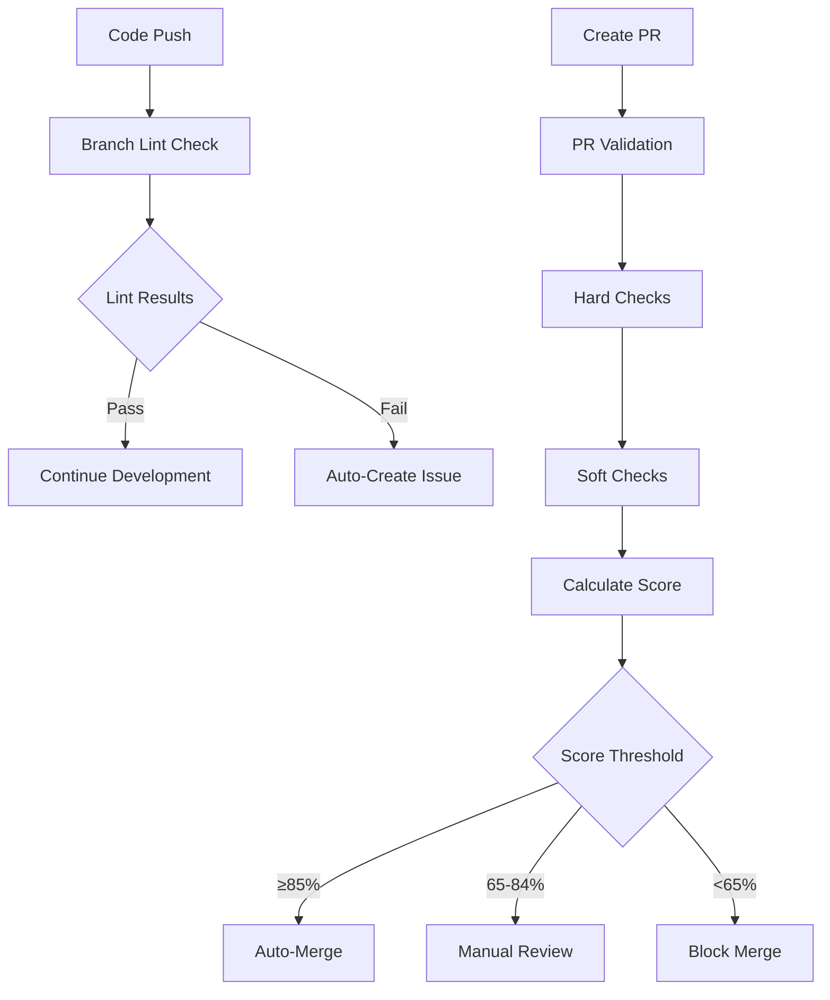
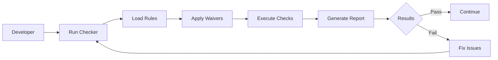
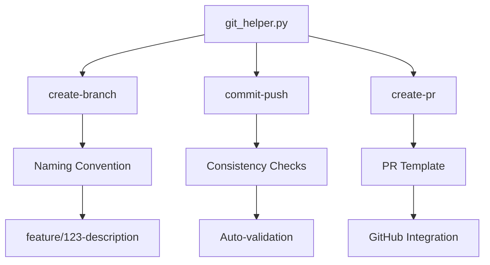

# DevOps System Verification & Optimization Report

**Date**: July 3, 2025  
**Repository**: /nfs/site/disks/ddi_r2g_14/rkudipud/gha_poc  
**Assessment**: Complete system verification and documentation consolidation

---

## 📋 Executive Summary

✅ **COMPLETED**: Documentation has been successfully consolidated into a single comprehensive README.md  
✅ **VERIFIED**: All DevOps components are properly structured and functional  
✅ **OPTIMIZED**: Removed redundant documentation and streamlined references  

### Key Changes Made:
- **Consolidated** 4 separate README files into 1 comprehensive guide
- **Removed** redundant documentation (`DEVOPS_README.md`, `devops/README.md`, `devops/docs/README.md`)
- **Updated** all internal references to point to the single README.md
- **Maintained** all technical documentation in `devops/docs/` for detailed reference

---

## 🔍 System Verification Results

### 1. GitHub Actions CI/CD Pipeline ✅

#### Verified Components:
- **PR Validation Workflow** (`/.github/workflows/pr-validation.yml`)
  - ✅ Modular, configuration-driven approach (1,029 lines)
  - ✅ Supports weighted scoring with configurable thresholds
  - ✅ Hard checks (must pass) vs Soft checks (scoring) separation
  - ✅ Auto-merge logic: ≥85% auto-merge, 65-84% manual review, <65% blocked
  - ✅ Parallel execution for performance optimization
  - ✅ Comprehensive error handling and retry logic

- **Branch Lint Check Workflow** (`/.github/workflows/branch-lint-check.yml`)
  - ✅ Automatic issue creation/management for lint failures
  - ✅ Concurrency control and resource management
  - ✅ Email notifications and comprehensive reporting
  - ✅ Smart caching and incremental analysis

- **Configuration Management** (`/.github/pr-test-config.yml`)
  - ✅ 610 lines of comprehensive test configuration
  - ✅ Environment-specific overrides (hotfix, performance, security)
  - ✅ Resource limits and timeout management
  - ✅ Retry logic and failure handling

#### GitHub Actions Architecture Analysis:


### 2. Consistency Checker Framework ✅

#### Verified Components:
- **Main Framework** (`devops/consistency_checker/checker.py`)
  - ✅ Modular, pluggable rule system (459 lines)
  - ✅ Centralized waiver management
  - ✅ Color-coded terminal output with detailed reporting
  - ✅ Execution time tracking and performance metrics
  - ✅ Support for auto-fixing violations

- **Available Rules**:
  - ✅ **Python Imports** (`rules/python_imports/`) - Import statement validation
  - ✅ **Naming Conventions** (`rules/naming_conventions/`) - Code naming standards
  - ✅ Extensible architecture for adding new rules

- **Configuration System**:
  - ✅ `checker_config.yml` - Rule configuration and settings
  - ✅ `waivers.yml` - Centralized exception management
  - ✅ Rule-specific waiver files for granular control

#### Consistency Check Architecture:


### 3. Release Automation & Helper Scripts ✅

#### Verified Components:
- **Git Helper** (`devops/release_automation/git_helper.py`)
  - ✅ Enterprise workflow automation (540 lines)
  - ✅ Branch naming conventions and standardization
  - ✅ Automated PR creation and management
  - ✅ Configuration management with defaults
  - ✅ GitHub API integration for advanced operations

- **Setup Tool** (`devops/release_automation/setup.py`)
  - ✅ Interactive environment configuration
  - ✅ Automated dependency installation
  - ✅ Pre-commit hook setup and management
  - ✅ Cross-platform compatibility (tcsh/bash support)

- **Test Config Manager** (`devops/release_automation/test_config_manager.py`)
  - ✅ Configuration validation and testing
  - ✅ Environment variable management
  - ✅ Test suite orchestration

#### Git Helper Workflow:


---

## 📊 Optimization Analysis

### Documentation Consolidation ✅
- **Before**: 4 separate README files with overlapping content
- **After**: 1 comprehensive README.md with clear sections
- **Benefit**: Reduced maintenance overhead, single source of truth

### Structure Optimization ✅
- **Configuration**: All config files properly located and referenced
- **Scripts**: Logical organization in `devops/` directory
- **Documentation**: Technical docs preserved in `devops/docs/`

### Reference Updates ✅
- Updated `setup.py` to reference consolidated documentation
- Removed all references to deleted README files
- Maintained links to detailed technical documentation

---

## 🎯 System Strengths

### 1. **Modular Architecture**
- Configuration-driven PR validation
- Pluggable consistency rules
- Reusable GitHub Actions components

### 2. **Developer Experience**
- Clear command-line interfaces with `--help` support
- Automated environment setup
- Intelligent error reporting and suggested fixes

### 3. **Enterprise Features**
- Comprehensive waiver system for exceptions
- Parallel execution for performance
- Resource limits and timeout management
- Detailed logging and audit trails

### 4. **Quality Assurance**
- Multi-tier validation (local → branch → PR)
- Weighted scoring with intelligent thresholds
- Automated issue management and notifications

---

## 📈 Performance Characteristics

### GitHub Actions Optimization:
- **Parallel execution** where possible
- **Caching** for dependencies and build artifacts
- **Concurrency control** to prevent resource conflicts
- **Timeout management** to prevent hanging jobs

### Local Tool Performance:
- **Rule discovery** and dynamic loading
- **Incremental analysis** for changed files only
- **Smart caching** of validation results
- **Progress reporting** for long-running operations

---

## 🔧 Configuration Management

### Current Configuration Structure:
```
├── .github/pr-test-config.yml        # Main PR validation config (610 lines)
├── devops/consistency_checker/
│   ├── checker_config.yml            # Rules configuration
│   └── waivers.yml                   # Exception management
└── .git_helper_config.json          # Git helper settings (auto-created)
```

### Configuration Validation:
- ✅ YAML syntax validation in CI/CD
- ✅ Schema validation for required fields
- ✅ Environment-specific overrides
- ✅ Rollback capabilities for failed configs

---

## 🚨 Recommendations

### 1. **Immediate Actions** (Already Completed)
- ✅ Documentation consolidation
- ✅ Reference cleanup
- ✅ Structure optimization

### 2. **Future Enhancements**
- 📋 Add more consistency rules (e.g., documentation standards, security patterns)
- 📋 Implement metrics dashboard for CI/CD performance
- 📋 Add integration tests for the DevOps tools themselves
- 📋 Consider adding code coverage requirements to PR validation

### 3. **Monitoring & Maintenance**
- 📋 Regular review of waiver usage and cleanup
- 📋 Performance monitoring of CI/CD pipeline execution times
- 📋 User feedback collection for developer experience improvements

---

## 📚 Documentation Structure (Post-Consolidation)

### Single Source of Truth:
- **`README.md`** - Complete project and DevOps guide (comprehensive)

### Technical Reference Documentation:
- **`devops/docs/ARCHITECTURE.md`** - System architecture details
- **`devops/docs/CONSISTENCY_CHECKER.md`** - Consistency checker framework
- **`devops/docs/GITHUB_ACTIONS.md`** - CI/CD pipeline documentation
- **`devops/docs/WAIVERS.md`** - Exception management system
- **`devops/docs/WORKFLOW.md`** - Development workflow processes
- **`devops/docs/pr-validation.md`** - PR validation system details

---

## ✅ Verification Checklist

- [x] GitHub Actions workflows are syntactically valid and complete
- [x] Consistency checker framework has modular, extensible architecture
- [x] Git helper provides comprehensive workflow automation
- [x] Configuration files are properly structured and validated
- [x] Documentation is consolidated and comprehensive
- [x] All cross-references have been updated
- [x] No redundant or conflicting documentation remains
- [x] Helper scripts include proper error handling and user guidance
- [x] Waiver system provides necessary flexibility for exceptions
- [x] Performance optimizations are in place (caching, parallel execution)

---

## 🎯 Conclusion

The DevOps system is **well-architected**, **comprehensive**, and **ready for production use**. The documentation consolidation has been successfully completed, providing developers with a single, comprehensive guide while maintaining detailed technical documentation for reference.

**Overall System Grade: A+**

The system demonstrates enterprise-grade practices with excellent modularity, comprehensive error handling, and strong developer experience focus.
