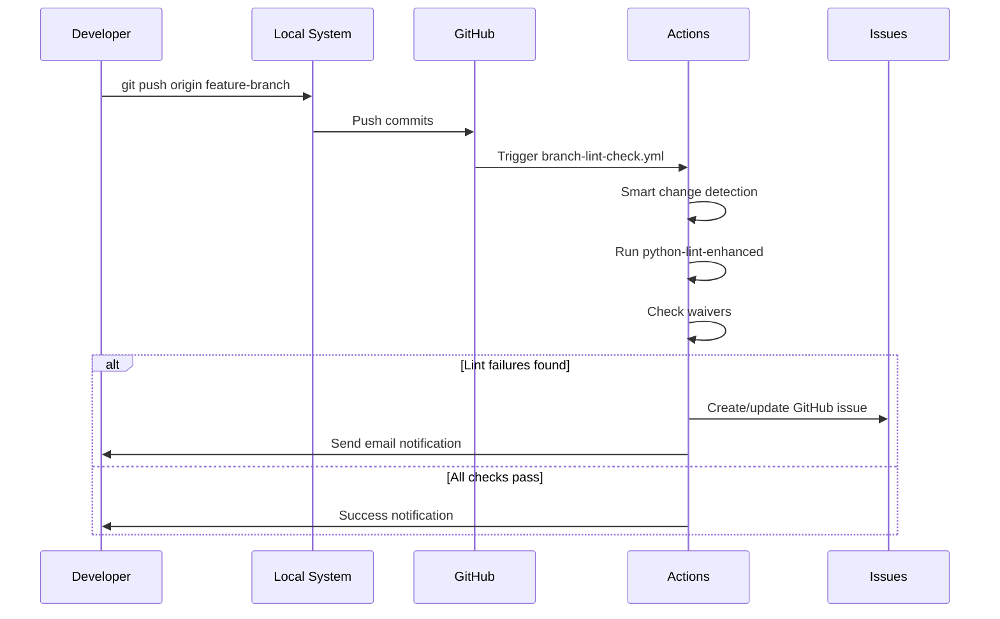
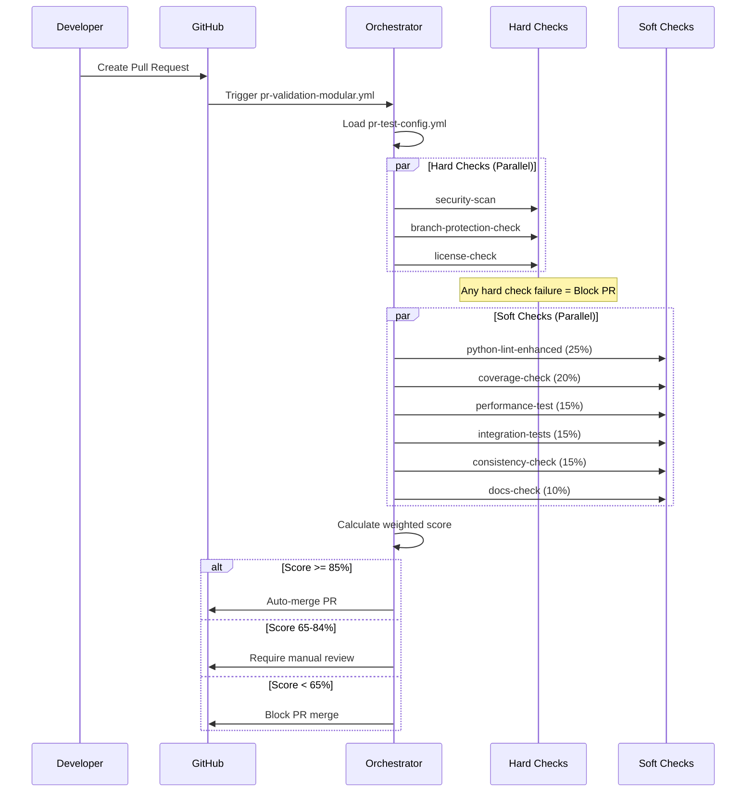

# CI/CD Solution Architecture

## System Overview

This enterprise CI/CD solution is designed for **5000+ developers** with a modular, scalable architecture that ensures code quality, security, and developer productivity.

## 🏗️ Core Architecture

### 1. **Protected Branch Model**
```
┌─────────────────┐    ┌──────────────────┐    ┌─────────────────┐
│   Developer     │    │   Feature        │    │   Main Branch   │
│   Workstation   │    │   Branches       │    │   (Protected)   │
│                 │    │                  │    │                 │
│ Local Checks ───┼───►│ Branch Lint   ───┼───►│ PR Validation   │
│ git-helper CLI  │    │ Auto Issues      │    │ Auto Merge      │
└─────────────────┘    └──────────────────┘    └─────────────────┘
```

### 2. **Validation Pipeline**
```
Push to Branch
      │
      ▼
┌─────────────────┐
│ Branch Lint     │ ← Triggered on every push (except main)
│ Workflow        │
├─────────────────┤
│ • Smart Change  │
│   Detection     │
│ • Python Lint   │
│ • Waiver Check  │
│ • Issue Create  │
└─────────────────┘
      │
      ▼ (Create PR)
┌─────────────────┐
│ PR Validation   │ ← Triggered on PR events
│ Workflow        │
├─────────────────┤
│ • Hard Checks   │ (Must Pass)
│ • Soft Checks   │ (Weighted Score)
│ • Auto Decision │ (Merge/Review/Block)
└─────────────────┘
```

## 🧩 Modular Components

### GitHub Actions Architecture

```
.github/
├── workflows/
│   ├── branch-lint-check.yml     # Branch validation
│   └── pr-validation-modular.yml # PR validation orchestrator
│
├── actions/                      # Reusable action components
│   ├── python-lint-enhanced/     # Enhanced Python linting
│   ├── security-scan/            # Security vulnerability scanning
│   ├── coverage-check/           # Test coverage analysis  
│   ├── consistency-check/        # Code consistency validation
│   ├── branch-protection-check/  # Branch protection compliance
│   ├── license-check/            # License compliance
│   ├── docs-check/               # Documentation quality
│   ├── performance-test/         # Performance regression
│   ├── integration-tests/        # Integration test suite
│   ├── test-orchestrator/        # Central test coordinator
│   └── email-notification/       # Notification system
│
└── pr-test-config.yml            # Master test configuration
```

### Test Classification System

#### **Hard Checks** (Must Pass - No Score)
- **Security Critical**: Vulnerabilities, secrets, critical security issues
- **Branch Protection**: Compliance with branch protection rules  
- **License Compliance**: Legal and licensing requirements

#### **Soft Checks** (Weighted Scoring)
| Check | Weight | Purpose |
|-------|--------|---------|
| Python Lint Enhanced | 25% | Code style, quality, standards |
| Coverage Check | 20% | Test coverage analysis |
| Performance Test | 15% | Performance regression detection |
| Integration Tests | 15% | End-to-end functionality |
| Consistency Check | 15% | Code consistency and patterns |
| Documentation | 10% | Documentation quality and completeness |

### Scoring System
```
Total Score = Σ(Check Score × Weight) for all Soft Checks

Decision Matrix:
├── Score ≥ 85%: Auto-merge ✅
├── Score 65-84%: Manual review required 👀  
└── Score < 65%: Block merge ❌
```

## 🔧 Developer Tools

### 1. **git-helper CLI**
```python
# Core Operations
git-helper create-branch --type feature --issue 123 --description "feature-name"
git-helper commit-push --message "commit message"
git-helper create-pr --title "PR title" --description "details"
git-helper check-status
git-helper sync-main
git-helper resolve-conflicts

# Configuration
git-helper config --set github.token "token"
git-helper config --set email.notifications true
```

### 2. **Local Consistency Checker**
```python
# Framework Structure
consistency_checker/
├── checker.py              # Main framework
├── checker_config.yml      # Configuration
├── waivers.yml             # Centralized waivers
└── rules/                  # Pluggable rules
    ├── python_imports/     # Import validation
    └── naming_conventions/ # Naming standards
```

## 📊 Configuration Management

### 1. **Master Test Configuration** (`.github/pr-test-config.yml`)
```yaml
global_config:
  auto_merge_threshold: 85
  manual_review_threshold: 65  
  block_threshold: 64
  parallel_execution: true
  timeout_minutes: 30

test_suite:
  - id: "security_critical"
    enforcement: "hard"       # Must pass
    weight: 0
    action_path: ".github/actions/security-scan"
    enabled: true
    
  - id: "python_lint_enhanced" 
    enforcement: "soft"       # Contributes to score
    weight: 25
    action_path: ".github/actions/python-lint-enhanced"
    enabled: true
    
# Environment-specific overrides
environments:
  production:
    auto_merge_threshold: 90  # Higher bar for production
  staging:
    auto_merge_threshold: 80
```

### 2. **Centralized Waiver Management** (`consistency_checker/waivers.yml`)
```yaml
settings:
  default_expiry_days: 90
  expiry_warning_days: 14
  max_waivers_per_file: 10
  security_critical_rules: ["S101", "S102", "B101"]

rule_waivers:
  - file: "module.py"
    rule: "E501"
    reason: "Complex algorithm requires long lines"
    approved_by: "tech-lead@company.com" 
    expires: "2025-12-31"

line_waivers:
  - violation_line: "src/config.py:45:80: E501 line too long"
    code_content: "DATABASE_URL = 'postgresql://...'"
    reason: "URL cannot be broken"
    approved_by: "senior-dev@company.com"

bulk_waivers:
  - pattern: "tests/**/*.py"
    rules: ["E501", "F841"]
    reason: "Test files have relaxed standards"
    approved_by: "qa-lead@company.com"
```

## 🔄 Workflow Execution

### Branch Push Flow


### PR Validation Flow


## 🔐 Security Architecture

### 1. **Multi-Layer Security**
```
┌─────────────────────────────────────────────┐
│ Branch Protection (GitHub Settings)        │
├─────────────────────────────────────────────┤
│ Hard Security Checks (Pre-merge)           │
│ • Vulnerability scanning (Bandit)          │
│ • Secret detection (GitHub native)         │
│ • Dependency scanning (Safety)             │
├─────────────────────────────────────────────┤  
│ Access Controls                             │
│ • GitHub RBAC integration                   │
│ • Waiver approval workflow                  │
│ • Audit trail logging                       │
└─────────────────────────────────────────────┘
```

### 2. **Waiver Security Controls**
- **Approval Required**: All waivers need approved_by field
- **Expiration Tracking**: Automatic expiry and warnings
- **Security Rules**: Special approval for security-critical rules
- **Audit Trail**: Complete history of waiver changes

## 📈 Scalability Design

### 1. **Performance Optimizations**
- **Smart Change Detection**: Only process modified files
- **Parallel Execution**: Independent checks run concurrently  
- **Incremental Processing**: Cache results between runs
- **Resource Limits**: Timeouts and memory constraints

### 2. **Enterprise Scaling**
```
Self-hosted Runners
├── Runner Pool A: Security & Compliance
├── Runner Pool B: Performance & Integration  
├── Runner Pool C: Code Quality & Linting
└── Auto-scaling based on queue depth
```

### 3. **Cost Management**
- **Conditional Execution**: Skip irrelevant workflows
- **Artifact Cleanup**: Automatic cleanup policies
- **Resource Monitoring**: Track and optimize resource usage

## 🔍 Monitoring & Observability

### Key Metrics
- **Pipeline Success Rate**: Overall health indicator
- **Mean Time to Merge**: Developer productivity
- **Security Issue Detection Rate**: Security effectiveness  
- **Code Quality Trends**: Quality improvement tracking
- **Resource Utilization**: Cost and performance monitoring

### Alerting
- **Pipeline Failures**: Immediate notification to ops team
- **Security Issues**: Alert security team on critical findings
- **Performance Degradation**: Monitor execution time trends
- **Cost Thresholds**: Alert on unexpected cost increases

## 🔧 Extensibility

### Adding New Checks
1. **Create Action**: Implement new GitHub Action
2. **Update Config**: Add to `pr-test-config.yml`
3. **Set Weight**: Assign appropriate weight for soft checks
4. **Document**: Update team documentation

### Environment Customization
```yaml
# Override behavior per environment
environments:
  development:
    auto_merge_threshold: 70  # More lenient
    enabled_checks: ["basic_lint", "security"]
    
  production:
    auto_merge_threshold: 95  # Strict requirements
    enabled_checks: ["all"]
    additional_reviewers: ["security-team"]
```

## 🎯 Design Principles

1. **Developer Experience First**: Minimize friction in daily workflow
2. **Security by Default**: Security checks cannot be bypassed
3. **Modular & Extensible**: Easy to add/remove/modify components
4. **Configuration Driven**: Behavior controlled via configuration files
5. **Fail Fast**: Catch issues early in the development cycle
6. **Transparent**: Clear feedback on why decisions are made
7. **Scalable**: Designed to handle thousands of concurrent developers

---

This architecture provides a robust, scalable foundation for enterprise-grade CI/CD while maintaining developer productivity and code quality standards.
