# DevOps CI/CD System

A comprehensive DevOps solution with automated validation, local consistency checks, and developer productivity tools for enterprise-scale development.

## 🎯 System Components

### 1. 🤖 GitHub Actions CI/CD
**Automated validation and deployment pipeline**
- **PR Validation**: Automated testing, security scans, and quality gates
- **Branch Protection**: Automated lint checks on every push
- **Auto-Merge**: Intelligent merge decisions based on quality scores
- **Security**: Vulnerability scanning and compliance checks

### 2. 🔍 Local Consistency Checks
**Pre-commit validation tools for developers**
- **Code Quality**: Python linting, style checks, and complexity analysis
- **Security**: Local security scanning and secret detection
- **Consistency**: Naming conventions, imports, and project standards
- **Waivers**: Managed exceptions for special cases

### 3. �️ Developer Helper Scripts
**Productivity tools for common workflows**
- **Git Helper**: Streamlined branch creation, commits, and PR management
- **Setup Tool**: Automated environment configuration
- **Config Manager**: Test configuration and validation management

---

## 🚀 Quick Start

### For Developers (5 Minutes)

```bash
# 1. Setup environment
python devops/release_automation/setup.py

# 2. Run local checks before any Git operations
python devops/consistency_checker/checker.py

# 3. Create feature branch and make changes
python devops/release_automation/git_helper.py create-branch --type feature --issue 123
# ... make your changes ...

# 4. Commit and push (triggers CI/CD automatically)
python devops/release_automation/git_helper.py commit-push --message "Add feature"
```

### For Admins (Configuration)

```bash
# Configure PR validation rules
edit .github/pr-test-config.yml

# Configure consistency rules
edit devops/consistency_checker/checker_config.yml

# Configure waivers
edit devops/consistency_checker/waivers.yml
```

---

## 📊 System Architecture

```mermaid
flowchart TD
    Dev[👨‍💻 Developer] --> Local{🔍 Local Checks}
    Local --> |Pass| Git[📝 Git Operations]
    Local --> |Fail| Fix[🔧 Fix Issues]
    Fix --> Local
    
    Git --> Push[⬆️ Push to Branch]
    Push --> BranchCI[🤖 Branch Lint CI]
    BranchCI --> |Issues Found| Issue[📋 Auto-Create Issues]
    BranchCI --> |Clean| PR[🔄 Create PR]
    
    PR --> PRCI[� PR Validation CI]
    PRCI --> Hard{🛡️ Hard Checks}
    Hard --> |Fail| Block[❌ Block Merge]
    Hard --> |Pass| Soft[📊 Soft Checks]
    
    Soft --> Score{📈 Calculate Score}
    Score --> |≥85%| AutoMerge[✅ Auto-Merge]
    Score --> |65-84%| Review[👀 Manual Review]
    Score --> |<65%| Block
```



---

## 🔧 Component Details

### Modular PR Validation
- **Configuration-driven** test execution
- **Intelligent scoring** with auto-merge decisions
- **Hard vs Soft checks** for flexible validation
- **Environment-specific** overrides and customization

### Developer Tools
- **git_helper CLI** for streamlined git workflows
- **Consistency checker** with pluggable rules
- **Local validation** with pre-commit hooks
- **Waiver system** for managed exceptions

### Automation & Integration
- **Parallel execution** for optimal performance
- **Comprehensive reporting** with actionable insights
- **Notification system** for teams and individuals
- **Integration** with external tools and services

## 📁 File Structure

```
devops/
├── docs/                          # 📚 All documentation (YOU ARE HERE)
│   ├── README.md                  # This index file
│   ├── ARCHITECTURE.md            # System architecture
│   ├── pr-validation.md           # PR validation system guide
│   ├── QUICK_START.md             # Quick start guide
│   └── ...                       # Additional documentation
│
├── consistency_checker/           # 🔍 Code consistency framework
│   ├── checker.py                 # Main checker framework
│   ├── checker_config.yml         # Configuration
│   ├── waivers.yml                # Centralized waivers
│   └── rules/                     # Pluggable rules
│
└── release_automation/            # 🚀 Automation tools
    ├── git_helper.py              # Git workflow CLI
    ├── setup.py                   # Setup and configuration
    └── test_config_manager.py     # Configuration management
```

## 🔗 Quick Links

| Task | Command | Documentation |
|------|---------|---------------|
| **Start using PR validation** | Edit `.github/pr-test-config.yml` | [PR Validation Guide](pr-validation.md) |
| **Run consistency checks** | `python devops/consistency_checker/checker.py --all` | [Consistency Checker](CONSISTENCY_CHECKER.md) |
| **Create feature branch** | `python devops/release_automation/git_helper.py create-branch` | [Git Helper](git-helper.md) |
| **Setup development environment** | `python devops/release_automation/setup.py` | [Setup Guide](setup.md) |
| **Manage waivers** | Edit `devops/consistency_checker/waivers.yml` | [Waivers System](WAIVERS.md) |

## 🆘 Getting Help

1. **Check the relevant documentation** using the index above
2. **Run tools with `--help`** flag for command-specific help
3. **Review configuration examples** in the documentation
4. **Check troubleshooting sections** in each guide


