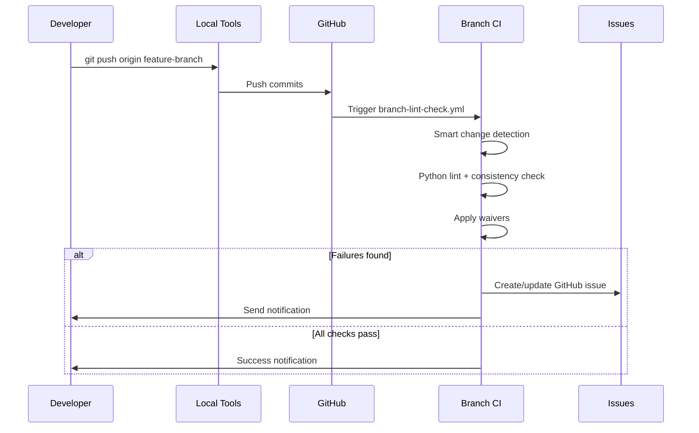
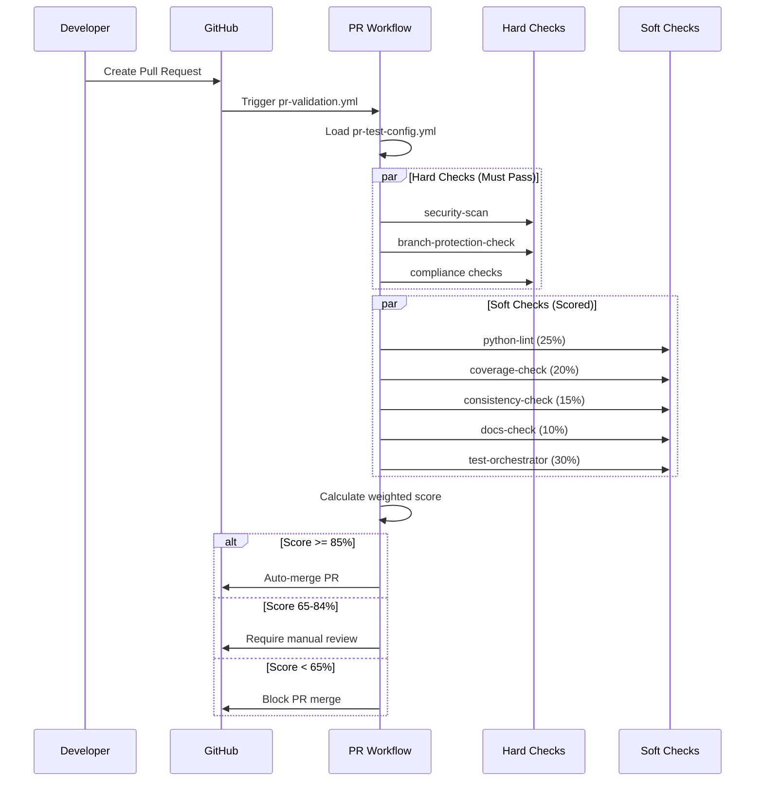

# Development Workflow

## Overview

This document describes the complete CI/CD workflow for daily development, detailing how code changes move from local development through validation to deployment using the comprehensive DevOps system.

## 🔄 Complete Development Lifecycle

### Stage 1: Local Development

Developers work locally with these integrated tools:

- **Git Helper CLI**: Streamlined Git workflow automation
- **Consistency Checker**: Local code quality validation
- **Pre-commit Hooks**: Automatic validation before commits
- **Setup Tool**: Environment and configuration management

### Stage 2: Branch Validation

When code is pushed to a feature branch, the automated pipeline triggers:

1. **Branch Lint Workflow** (`.github/workflows/branch-lint-check.yml`)
   - **Smart Change Detection**: Identifies modified files
   - **Python Linting**: Linting with waiver support
   - **Consistency Validation**: Rules-based code consistency
   - **Waiver Processing**: Applies approved exceptions
   - **Issue Management**: Auto-creates/updates GitHub issues
   - **Notifications**: Email alerts for failures

### Stage 3: Pull Request Validation

When a pull request is created or updated:

1. **PR Validation Workflow** (`.github/workflows/pr-validation.yml`)
   - **Configuration Loading**: Reads `.github/pr-test-config.yml`
   - **Hard Checks Execution**: Must-pass security and compliance checks
   - **Soft Checks Execution**: Weighted quality assessments
   - **Score Calculation**: Computes overall quality score
   - **Automated Decision**: Auto-merge, review, or block based on thresholds

### Stage 4: Main Branch Protection

The main branch is protected through:

1. **Required Status Checks**: All critical validations must pass
2. **Branch Protection Rules**: Direct pushes prevented
3. **Automated Merge**: Score ≥ 85% enables auto-merge
4. **Manual Review**: Scores 65-84% require review
5. **Merge Blocking**: Scores < 65% block merging

## 🎯 GitHub Actions Architecture

### Core Workflows

```
.github/workflows/
├── branch-lint-check.yml     # Feature branch validation
└── pr-validation.yml         # Pull request validation and scoring
```

### Reusable Actions

```
.github/actions/
├── python-lint/              # Python linting with waivers
├── consistency-check/        # Code consistency validation
├── security-scan/           # Security vulnerability scanning
├── coverage-check/          # Test coverage analysis
├── docs-check/              # Documentation validation
├── branch-protection-check/ # Branch protection compliance
├── test-orchestrator/       # Test execution coordination
└── email-notification/      # Result notification system
```

### Configuration Files

```
.github/
├── pr-test-config.yml       # Master test configuration
├── workflows/               # Workflow definitions
└── actions/                 # Reusable action components
```

## 📊 Validation Pipeline Flow

### Branch Push Flow



### PR Validation Flow



## 🛠️ Developer Workflow Steps

### Daily Development Process

```bash
# 1. Initial Setup (one-time)
python devops/release_automation/setup.py

# 2. Create feature branch
python devops/release_automation/git_helper.py create-branch --type feature --issue 123

# 3. Develop and validate locally
python devops/consistency_checker/checker.py  # Local validation
git add .
git commit -m "Implement feature"  # Pre-commit hook runs

# 4. Push and monitor branch validation
python devops/release_automation/git_helper.py commit-push --message "Implement feature"
python devops/release_automation/git_helper.py check-status

# 5. Create and monitor PR
python devops/release_automation/git_helper.py create-pr --title "Add new feature"
# Monitor GitHub UI for PR validation results
```

### Local Validation Tools

#### Consistency Checker
```bash
# Run all checks
python devops/consistency_checker/checker.py

# Run specific rules
python devops/consistency_checker/checker.py --rule python_imports

# Auto-fix issues
python devops/consistency_checker/checker.py --fix

# Generate reports
python devops/consistency_checker/checker.py --report-format html
```

#### Configuration Manager
```bash
# Validate PR test configuration
python devops/release_automation/test_config_manager.py --validate

# Update test thresholds
python devops/release_automation/test_config_manager.py --set-threshold auto_merge 90
```

## 📋 Key System Components

### DevOps Tools (`devops/`)

#### Release Automation (`devops/release_automation/`)
- **git_helper.py**: Git workflow automation and productivity
- **setup.py**: Environment setup and configuration
- **test_config_manager.py**: PR test configuration management

#### Consistency Checker (`devops/consistency_checker/`)
- **checker.py**: Main validation framework
- **checker_config.yml**: Rules configuration
- **waivers.yml**: Exception management
- **rules/**: Pluggable validation rules
  - `python_imports/`: Import order and style validation
  - `naming_conventions/`: Naming pattern enforcement

### GitHub Integration (`.github/`)

#### Workflows
- **branch-lint-check.yml**: Automated branch validation
- **pr-validation.yml**: Comprehensive PR validation and scoring

#### Actions (Reusable Components)
- **python-lint/**: Advanced Python linting with waiver support
- **consistency-check/**: Code consistency validation
- **security-scan/**: Security vulnerability and secret detection
- **coverage-check/**: Test coverage analysis and reporting
- **docs-check/**: Documentation quality validation
- **branch-protection-check/**: Branch protection compliance
- **test-orchestrator/**: Centralized test execution
- **email-notification/**: Result notification system

#### Configuration
- **pr-test-config.yml**: Master configuration for test weights and thresholds

### Project Files

#### Core Scripts
- **pandora_tc_ext_fm.py**: Main project module
- **make_venv.csh**: Virtual environment setup script
- **requirements.txt**: Python dependencies
- **crt.pre.install**: Pre-installation requirements

## 🔧 Configuration Management

### Test Configuration (`.github/pr-test-config.yml`)

```yaml
global_config:
  auto_merge_threshold: 85     # Auto-merge if score >= 85%
  manual_review_threshold: 65  # Review required if 65-84%
  block_threshold: 64          # Block if score <= 64%
  parallel_execution: true
  timeout_minutes: 30

test_suite:
  # Hard checks (must pass)
  - id: "security_critical"
    enforcement: "hard"
    weight: 0
    action_path: ".github/actions/security-scan"
    
  # Soft checks (weighted scoring)
  - id: "python_lint"
    enforcement: "soft"
    weight: 25
    action_path: ".github/actions/python-lint"
    
  - id: "coverage_check"
    enforcement: "soft"
    weight: 20
    action_path: ".github/actions/coverage-check"
```

### Waiver Management (`devops/consistency_checker/waivers.yml`)

```yaml
settings:
  default_expiry_days: 90
  expiry_warning_days: 14
  max_waivers_per_file: 10

rule_waivers:
  - file: "legacy_module.py"
    rule: "E501"
    reason: "Legacy code with complex algorithms"
    approved_by: "tech-lead@company.com"
    expires: "2025-12-31"

line_waivers:
  - violation_line: "config.py:45:80: E501 line too long"
    reason: "Configuration URL cannot be split"
    approved_by: "senior-dev@company.com"
    expires: "2025-06-30"
```

## 🔍 Monitoring and Troubleshooting

### Branch Validation Issues

1. **Lint Failures**
   - Check GitHub Actions logs for specific errors
   - Run local consistency checker: `python devops/consistency_checker/checker.py`
   - Apply waivers if issues cannot be fixed immediately

2. **Waiver Problems**
   - Verify waiver format in `devops/consistency_checker/waivers.yml`
   - Ensure approval and expiration fields are present
   - Check file patterns match actual file paths

3. **Pipeline Timeouts**
   - Review action timeout settings in `pr-test-config.yml`
   - Check for long-running or infinite loops in code

### PR Validation Issues

1. **Hard Check Failures** (Must be fixed)
   - Security vulnerabilities: Review security-scan results
   - Branch protection: Ensure compliance with repository settings
   - Syntax errors: Fix Python syntax issues

2. **Low Soft Check Scores**
   - **Python Lint (25%)**: Fix code style and quality issues
   - **Coverage (20%)**: Add tests to improve coverage
   - **Consistency (15%)**: Address consistency checker violations
   - **Documentation (10%)**: Add/update docstrings and documentation
   - **Tests (30%)**: Ensure all tests pass

3. **Configuration Issues**
   - Validate `pr-test-config.yml` syntax
   - Use test config manager: `python devops/release_automation/test_config_manager.py --validate`

## 💡 Best Practices

### For Developers

1. **Local-First Approach**
   - Always run consistency checker before pushing
   - Use pre-commit hooks for early validation
   - Fix issues locally rather than in CI

2. **Quality Focus**
   - Write tests for new features
   - Update documentation for changes
   - Address all linting and consistency issues

3. **Efficient Workflow**
   - Use git_helper CLI for standardized operations
   - Monitor branch validation before creating PRs
   - Address automated feedback promptly

### For Maintainers

1. **Configuration Management**
   - Review and adjust test weights based on team feedback
   - Monitor auto-merge rates and adjust thresholds
   - Regularly review and approve waivers

2. **System Maintenance**
   - Update GitHub Actions versions regularly
   - Monitor pipeline performance and success rates
   - Review and expire old waivers

3. **Team Support**
   - Provide clear feedback on validation failures
   - Document common issues and solutions
   - Train team on new tools and processes

## 🚀 Advanced Features

### Environment-Specific Configuration

The system supports different validation criteria for different environments:

```yaml
environments:
  development:
    auto_merge_threshold: 75    # More lenient for dev
    enabled_checks: ["basic_lint", "security"]
    
  staging:
    auto_merge_threshold: 80    # Moderate requirements
    
  production:
    auto_merge_threshold: 95    # Strictest requirements
    additional_reviewers: ["security-team", "architecture-team"]
```

### Smart Change Detection

The branch validation workflow includes intelligent change detection:
- Only validates modified files for performance
- Detects file type changes to apply appropriate rules
- Skips validation for documentation-only changes (configurable)

### Integration Points

The workflow integrates with external systems:
- **Email Notifications**: Alert teams on validation failures
- **Issue Tracking**: Auto-create GitHub issues for persistent problems
- **Metrics Collection**: Track validation success rates and performance
- **Security Scanning**: Integration with security vulnerability databases

---

## 📚 Related Documentation

- **[SYSTEM_ARCHITECTURE.md](SYSTEM_ARCHITECTURE.md)** - Complete system design and architecture
- **[DEVELOPER_GUIDE.md](DEVELOPER_GUIDE.md)** - Comprehensive developer tools guide
- **[VALIDATION_SYSTEM.md](VALIDATION_SYSTEM.md)** - Detailed validation framework documentation

---

This workflow provides a comprehensive, automated, and developer-friendly approach to maintaining code quality while ensuring rapid development velocity and robust security practices.
